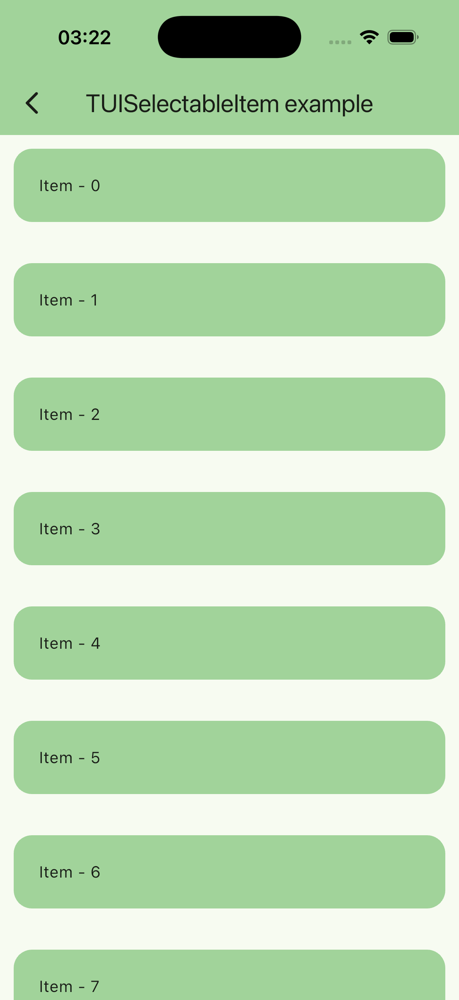
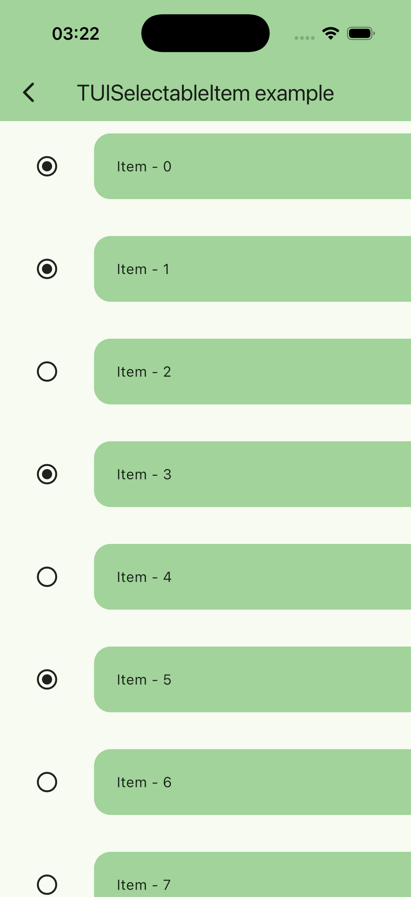
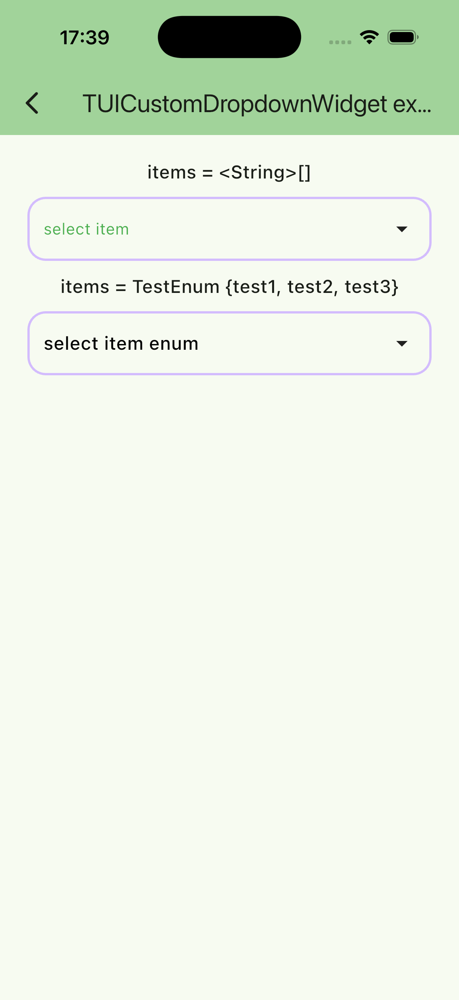
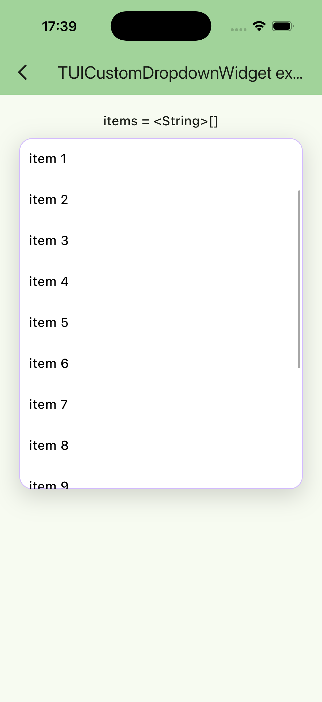
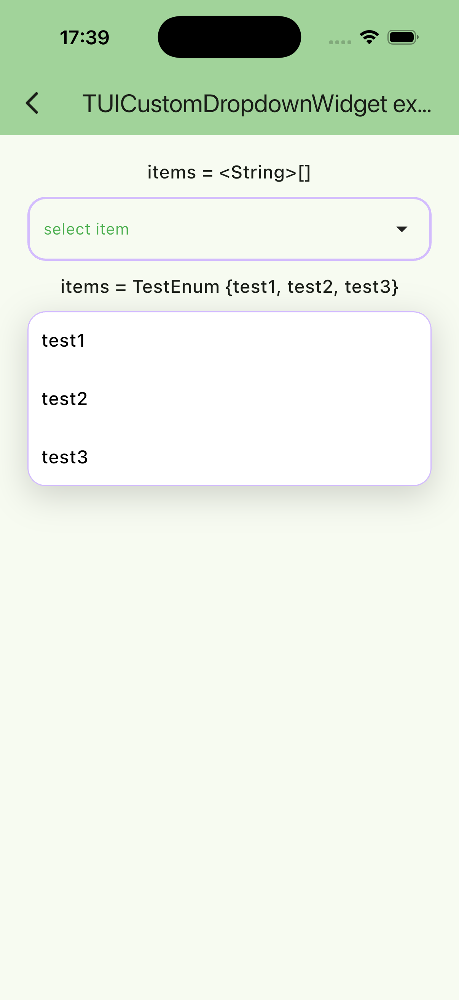
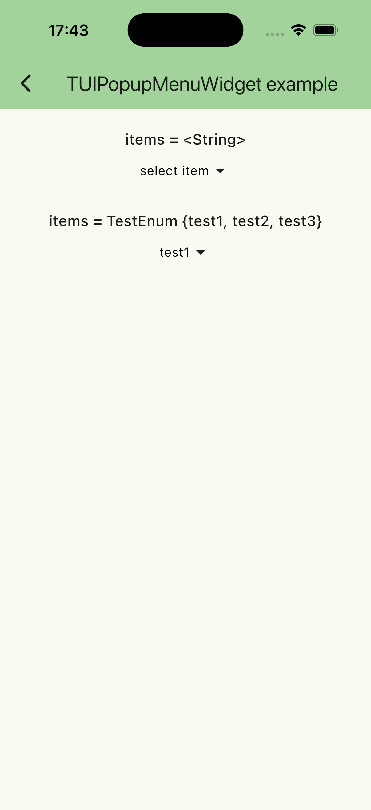
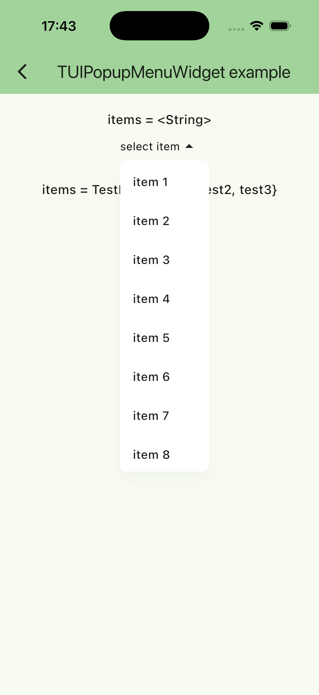
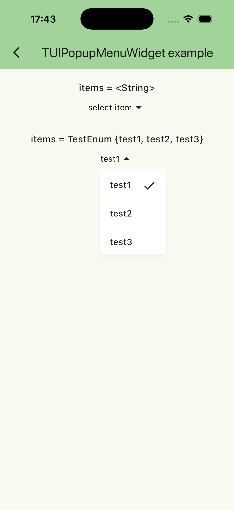

# tunable_ui_kit

English version: [README.md](README.md)

## Библиотека, содержащая разные необходимые виджеты, без зависимостей от других библиотек.
#### Последние изменения шаблона были произведены на `Flutter version 3.35.7` `Dart version 3.9.2`

#### <u>Библиотека разрабатывается для использования на IOS и Android, но также может работать и на других платформах.</u>

### Структура проекта

```
tunable_ui_kit/
├── example/                  # Примитивное приложение - пример использования библиотеки
│   └── lib/
│       └── usage_examples/   # Примеры использования виджетов
│
├── images/                   # Директория с изображениями для README
│   └── ...                   # Скриншоты и другие изображения
│
└── lib/                      # Основной код библиотеки
    └── src/                  # Исходный код
        ├── components/       # Директория с виджетами
        │   ├── button/       # Компонент кнопки
        │   ├── card/         # Компонент карточки
        │   └── ...           # Другие компоненты
        │
        └── tunable_ui_kit.dart   # Основной файл экспорта библиотеки
```

### Описание основных директорий

- `example/` - Демонстрационное приложение, показывающее примеры использования виджетов
- `lib/src/components/` - Основные компоненты библиотеки
- `lib/tunable_ui_kit.dart` - Файл, экспортирующий все публичные API библиотеки

## Зависимости:
- Анализатор: [lint](https://pub.dev/packages/lint)
  - Правила линтера: [Linter rules](https://dart.dev/tools/linter-rules)

## Установка

Для использования библиотеки в вашем проекте:

1. Добавьте следующую зависимость в `pubspec.yaml` вашего проекта:

```yaml
dependencies:
  tunable_ui_kit: ^0.3.0
```

2. Выполните команду для загрузки зависимостей:

```bash
flutter pub get
```

### Важные замечания

- Для продакшен использования рекомендуется указывать конкретную версию вместо `any`.
- Для обновления зависимости до последней совместимой версии используйте: `flutter pub upgrade`.

Для локальной разработки можно использовать path:

```yaml
dependencies:
  tunable_ui_kit:
    path: ../tunable_ui_kit
```

## Примеры использования виджетов:

### 1 — TUISelectableItem:
Виджет для выбора нескольких элементов одновременно:

```dart
TUISelectableItem(
    onSelectionModeChanged: (value) => setState(() => _selectionMode = value),
    selectionMode: _selectionMode,
    select: () => _selectItem(index),
    onTap: () => debugPrint('Item tapped'),
    isSelected: _selectedItems.contains(index),
    enabled: true,
    controlSide: TUIControlSide.start,
    offset: const Offset(100, 0),
    padding: const EdgeInsets.symmetric(horizontal: 10, vertical: 10),
    selectedWidget: const Icon(Icons.check_box),
    unselectedWidget: const Icon(Icons.check_box_outline_blank),
    child: YourChildWidget(...),
);
```

Параметры:

- **child** — дочерний виджет элемента.
- **onSelectionModeChanged** — callback при длительном нажатии; получает новое значение режима выбора (`!selectionMode`).
- **selectionMode** — активен ли режим выбора.
- **select** — callback выбора элемента (обычно переключает выбран/не выбран).
- **onTap** — callback обычного нажатия по элементу, когда `selectionMode == false`.
- **isSelected** — выбран ли элемент.
- **enabled** — включает/выключает только функциональность выбора (если `false`, то `onLongPress` не работает).
- **animationDuration** — длительность анимаций сдвига и смены иконки.
- **selectionColor** — цвет кнопки выбора (если используешь дефолтные иконки, цвет применяется через `IconTheme`).
- **offset** — смещение элемента при включении режима выбора (по умолчанию `Offset(40, 0)`).
- **selectedWidget** — виджет, показываемый при выбранном состоянии.
- **unselectedWidget** — виджет, показываемый при не выбранном состоянии.
- **padding** — внутренние отступы вокруг `child`.
- **controlSide** — сторона, с которой появляется контрол выбора и в какую сторону сдвигается контент (`TUIControlSide.start` / `TUIControlSide.end`).
- **enableRipple** — включает ripple-эффект Material (по умолчанию выключен).
- **rippleBorderRadius** — радиус скругления для клиппинга ripple-эффекта.





### 2 — TUICustomDropdownWidget<T\>:
Виджет - тонко кастомизируемый DropDown для выбора элемента:

```dart
 final items = <String>[
    'item 1',
    'item 2',
    'item 3',
  ];

String? _selectedItem;

void _onItemSelected(String item) => setState(() => _selectedItem = item);

TUICustomDropdownWidget<String>(
  items: items,
  selectedItem: _selectedItem,
  title: 'select item',
  onItemSelected: _onItemSelected,
),
```

Содержит также кучу настроек внешнего вида:
```dart
TUICustomDropdownWidget<T>(
  ...
  itemToString: - Функция для форматирования текста элемента. Нужно для того 
  чтобы отображать корректный текст в элементе меню (для универсальности). 
  Если не указана, используется стандартный метод `toString()` для [T].
  active: - флаг, показывающий, что дропдаун доступен к изменению
  animationDuration: - длительность анимации раскрытия/сворачивания дропдауна
  curve: - кривая анимации раскрытия/сворачивания дропдауна
  decoration: TUICustomDropdownDecoration(
    elementSeparator: - разделитель между элементами списка
    titleStyle: - стиль заголовка дропдауна
    selectedItemTextStyle: - стиль текста выбранного элемента
    titleOverflow: - переполнение заголовка дропдауна
    titleMaxLines: - максимальное количество строк заголовка дропдауна
    titleTextAlign: - выравнивание заголовка дропдауна
    height: - высота дропдауна
    width: - ширина дропдауна
    decoration: - декорация контейнера дропдауна
    rippleRadius: - радиус эффекта ripple при нажатии
    enableRipple: - включить/выключить ripple-эффект
    padding: - внутренние отступы контейнера
    expandIcon: - иконка индикатора раскрытия списка
  ),
  menuDecoration: TUICustomDropdownMenuDecoration(
    borderRadius: - радиус границ меню дропдауна
    itemColor: - цвет элементов меню дропдауна
    menuColor: - цвет контейнера меню дропдауна
    menuShadow: - тень контейнера меню дропдауна
    border: - граница контейнера меню дропдауна
    gradient: - градиент контейнера меню дропдауна
    constraints: - ограничения контейнера меню дропдауна
    настройки скроллбара
    scrollbarSettings: TUIScrollbarSettings(
      thumbVisibility: - видимость трека
      trackVisibility: - видимость трека
      thickness: - толщина
      radius: - радиус
      interactive: - интерктивность
      scrollbarOrientation: - ориентация
    ),
  ),
  itemDecoration: TUICustomDropdownItemDecoration(
    titleStyle: - стиль заголовка элемента
    titleOverflow: - переполнение заголовка элемента
    titleMaxLines: - максимальное количество строк заголовка элемента
    titleTextAlign: - выравнивание заголовка элемента
    padding: - отступы
    margin: - внешние отступы
    decoration: - декорация элемента
    enableRipple: - включить/выключить ripple-эффект
  ),
),
```






### 3 — TUIPopupMenuWidget<T\>:
Виджет - тонко кастомизируемое меню для выбора элемента

```dart
final items = <String>[
    'item 1',
    'item 2',
    'item 3',
    'item 4',
    'item 5',
    'item 6',
    'item 7',
    'item 8',
  ];

String? _selectedItem;

void _onSelected(String item) => setState(() => _selectedItem = item);

TUIPopupMenuWidget<String>(
  items: items,
  selectedItem: _selectedItem ?? 'select item',
  onSelected: _onSelected,
),
```

Содержит также кучу настроек внешнего вида:

```dart
TUIPopupMenuWidget<T>(
  ...
  items: - список элементов
  selectedItem: - выбранный элемент
  initialValue: - начальное значение
  onSelected: - функция выбора элемента
  itemToString: - Функция для форматирования текста элемента. Нужно для того 
  чтобы отображать корректный текст в элементе меню (для универсальности). 
  Если не указана, используется стандартный метод `toString()` для [T].
  enabled: - флаг доступности виджета
  popupDecoration: TUIPopupDecoration(
    padding: - внутренние отступы контейнера
    borderRadius: - радиус скругления контейнера
    elevation: - высота тени
    splashRadius: - радиус скругления при нажатии
    shadowColor: - цвет тени
    width: - ширина
    height: - высота
    alignment: - выравнивание
    decoration: - декорация контейнера
    gapWidget: - виджет для разделения элементов
    textStyle: - стиль текста
    icon: - иконка
    surfaceTintColor: - цвет оттенка поверхности (Material 3)
  ),
  popupMenuDecoration: TUIPopupMenuDecoration(
    offset: - смещение
    color: - цвет
    constraints: - ограничения
    animationStyle: - стиль анимации появления
    dividerWidget: - виджет для разделения элементов
    animationDuration: - длительность анимации
  ),
  popupElementDecoration: TUIPopupElementDecoration(
    height: - высота
    unselectedTextStyle: - стиль текста не выбранного элемента
    selectedTextStyle: - стиль текста выбранного элемента
    selectIcon: - иконка выбора
    rippleBorderRadius: - радиус скругления эффекта при нажатии
    enableRipple: - включить/выключить ripple-эффект
    splashColor: - цвет ripple-эффекта
    padding: - отступы
    decoration: - декорация выбранного элемента
  ),
),
```




