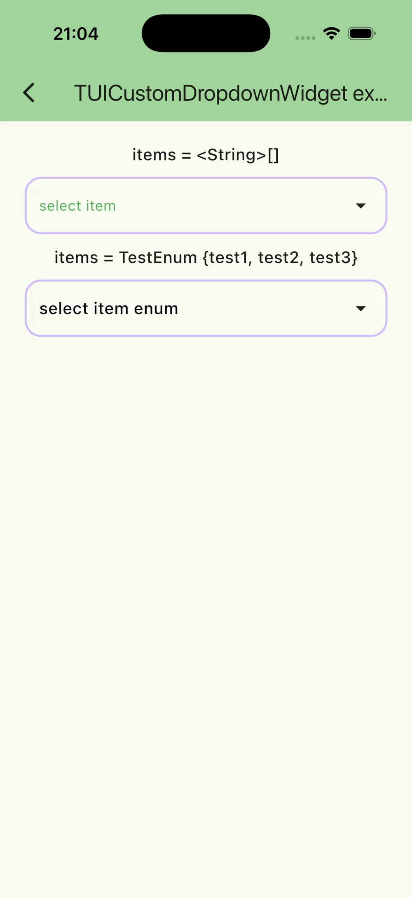

# TUICustomDropdownWidget<T>

English version: [custom_drop_down_widget_doc.md](custom_drop_down_widget_doc.md)

Тонко кастомизируемый DropDown для выбора элемента.



## Быстрый старт

```dart
final items = <String>[
  'item 1',
  'item 2',
  'item 3',
];

String? _selectedItem;

void _onItemSelected(String item) => setState(() => _selectedItem = item);

TUICustomDropdownWidget<String>(
  items: items,
  selectedItem: _selectedItem,
  title: 'select item',
  onItemSelected: _onItemSelected,
);
```

## Пример

[example/lib/usage_examples/tui_custom_dropdown_widget_screen.dart](https://github.com/JohnSmithKarter/tunable_ui_kit/blob/main/example/lib/usage_examples/tui_custom_dropdown_widget_screen.dart)

### Параметры

#### items

Список элементов.

#### title

Заголовок дропдауна.

#### onItemSelected

Callback выбора элемента.

#### selectedItem

Выбранный элемент.

#### itemToString

Функция для форматирования элемента в текст.

Если не указана, используется `toString()` для `T`.

#### active

Доступен ли дропдаун для взаимодействия.

#### animationDuration

Длительность анимации раскрытия/сворачивания.

#### curve

Кривая анимации раскрытия/сворачивания.

#### decoration

Стилизация виджета (`TUICustomDropdownDecoration`).

#### menuDecoration

Стилизация меню (`TUICustomDropdownMenuDecoration`).

#### itemDecoration

Стилизация элемента меню (`TUICustomDropdownItemDecoration`).
