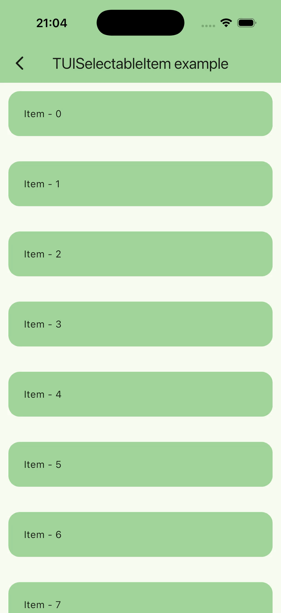

# TUISelectableItem

English version: [tui_selectable_item_doc.md](tui_selectable_item_doc.md)

Виджет для выбора нескольких элементов одновременно.




## Быстрый старт

```dart
TUISelectableItem(
  onSelectionModeChanged: (value) => setState(() => _selectionMode = value),
  selectionMode: _selectionMode,
  select: () => _selectItem(index),
  onTap: () => debugPrint('Item tapped'),
  isSelected: _selectedItems.contains(index),
  enabled: true,
  controlSide: TUIControlSide.start,
  offset: const Offset(100, 0),
  padding: const EdgeInsets.symmetric(horizontal: 10, vertical: 10),
  selectedWidget: const Icon(Icons.check_box),
  unselectedWidget: const Icon(Icons.check_box_outline_blank),
  child: YourChildWidget(...),
);
```

## Пример

[example/lib/usage_examples/tui_selectable_item_screen.dart](https://github.com/JohnSmithKarter/tunable_ui_kit/blob/main/example/lib/usage_examples/tui_selectable_item_screen.dart)

### Параметры

#### child

Дочерний виджет элемента.

#### onSelectionModeChanged

Callback при длительном нажатии.

Получает новое значение режима выбора (`!selectionMode`).

#### selectionMode

Активен ли режим выбора.

#### select

Callback выбора элемента (обычно переключает выбран/не выбран).

#### onTap

Callback обычного нажатия по элементу, когда `selectionMode == false`.

#### isSelected

Выбран ли элемент.

#### enabled

Включает/выключает только функциональность выбора.

Если `false`, то `onLongPress` не работает.

#### animationDuration

Длительность анимаций сдвига и смены иконки.

#### selectionColor

Цвет кнопки выбора.

Если используешь дефолтные иконки, цвет применяется через `IconTheme`.

#### offset

Смещение элемента при включении режима выбора.

По умолчанию `Offset(40, 0)`.

#### selectedWidget

Виджет, показываемый при выбранном состоянии.

#### unselectedWidget

Виджет, показываемый при не выбранном состоянии.

#### padding

Внутренние отступы вокруг `child`.

#### controlSide

Сторона, с которой появляется контрол выбора и в какую сторону сдвигается
контент.

Значения: `TUIControlSide.start` / `TUIControlSide.end`.

#### enableRipple

Включает ripple-эффект Material.

По умолчанию выключен.

#### rippleBorderRadius

Радиус скругления для клиппинга ripple-эффекта.
