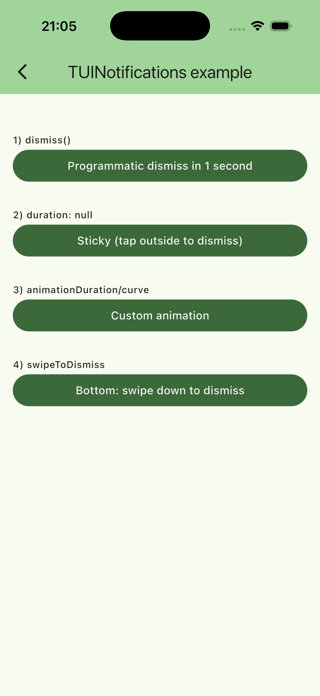

# TUINotifications (Баннер уведомлений)

English version: [notification_banner_doc.md](notification_banner_doc.md)



`TUINotifications` — это лёгкая система баннеров уведомлений, построенная поверх Flutter `Overlay`.

Она задумана как один, максимально настраиваемый «snackbar-подобный» баннер:

- Можно использовать стандартный UI баннера и кастомизировать его через `TUINotificationStyle`.
- Либо полностью заменить UI через `TUINotificationBuilder`.

## Быстрый старт

```dart
TUINotifications.show(
  context,
  message: 'Сохранено',
);
```

## Поведение

`TUINotifications` использует `OverlayEntry` и управляет:

- Позиционированием (сверху / снизу)
- Fade + slide анимацией
- Таймером автозакрытия (опционально)
- Конкурентным поведением (replace / queue / ignore)

## TUINotifications.show()

```dart
TUINotifications.show(
  context,
  message: 'Профиль обновлён',
  position: TUINotificationPosition.top,
  displayBehavior: TUINotificationDisplayBehavior.replace,
  duration: const Duration(seconds: 2),
  actionText: 'Отменить',
  onAction: () {
    // ...
  },
  showCloseIcon: true,
);
```

### Параметры

#### message

Текст сообщения, который отображается в стандартном UI баннера.

Если вы передаёте `builder`, `message` автоматически не используется (но вы можете использовать его вручную внутри кастомного билдера).

#### position

`TUINotificationPosition.top` или `TUINotificationPosition.bottom`.

Баннер выравнивается по выбранному краю и учитывает safe area inset’ы.

#### displayBehavior

Определяет, что происходит, когда `show()` вызывается в момент, когда другое уведомление уже показано:

- `TUINotificationDisplayBehavior.replace`
  - Сначала закрывает текущее уведомление (ожидая завершения анимации закрытия), затем показывает новое.
- `TUINotificationDisplayBehavior.queue`
  - Добавляет запросы в очередь и показывает их последовательно.
- `TUINotificationDisplayBehavior.ignoreIfVisible`
  - Игнорирует вызовы, пока уведомление видно.

#### duration

Длительность автозакрытия.

- Если `duration` равен `null` или `Duration.zero`, уведомление становится **липким** (sticky) и будет висеть до тех пор, пока вы его не закроете:
  - крестиком (`showCloseIcon: true`)
  - свайпом (если включено)
  - тапом по «барьеру» вокруг (если включено)
  - программно через `TUINotifications.dismiss()`

#### actionText / onAction

Опциональная кнопка действия для стандартного UI баннера.

Если переданы и `actionText`, и `onAction`, кнопка будет показана.

#### showCloseIcon

Показывать ли иконку закрытия в стандартном UI.

Если вы используете `builder`, вы полностью контролируете UI закрытия.

#### style

Опциональный `TUINotificationStyle`, который настраивает стандартный UI баннера.

Применяется только когда `builder == null`.

#### builder

Опциональный `TUINotificationBuilder`, который полностью переопределяет виджет баннера.

Сигнатура:

```dart
typedef TUINotificationBuilder = Widget Function(
  BuildContext context,
  VoidCallback dismiss,
);
```

Важно:

- Если `builder != null`, стандартный баннер не используется.
- Вы должны вызвать `dismiss()` из своего UI (например, в обработчике `onTap`), чтобы закрыть уведомление.

#### barrierDismissible

Если `true`, тап вне баннера (по области вокруг) закроет уведомление.

#### swipeToDismiss

Если `true`, баннер можно закрыть свайпом:

- позиция `top`: свайп вверх
- позиция `bottom`: свайп вниз

#### animationDuration / reverseAnimationDuration / curve

Настройка таймингов анимации появления и скрытия.

- `animationDuration`: как быстро баннер появляется
- `reverseAnimationDuration`: как быстро баннер исчезает
- `curve`: кривая для slide-анимации

#### margin

Дополнительный внешний отступ вокруг баннера.

Этот `margin` добавляется поверх:

- safe area inset’ов
- базового padding (`12px` от края)

Пример (сдвинуть баннер ниже):

```dart
TUINotifications.show(
  context,
  message: 'Сдвиг позиции',
  margin: const EdgeInsets.only(top: 48),
);
```

## Публичные методы управления

### TUINotifications.dismiss()

Закрывает текущее показанное уведомление.

Возвращает `Future`, который завершится после окончания анимации закрытия.

```dart
await TUINotifications.dismiss();
```

### TUINotifications.clearQueue()

Очищает очередь отложенных уведомлений.

Не закрывает уведомление, которое уже показано.

```dart
TUINotifications.clearQueue();
```

## TUINotificationStyle

`TUINotificationStyle` настраивает стандартный `TUINotificationBanner`.

Пример:

```dart
TUINotifications.show(
  context,
  message: 'Как будто success',
  style: const TUINotificationStyle(
    backgroundColor: Color(0xFF16A34A),
    foregroundColor: Colors.white,
    icon: Icons.check_circle_outline,
    borderRadius: BorderRadius.all(Radius.circular(18)),
  ),
);
```

### Поля стиля

- **backgroundColor** — цвет фона баннера
- **foregroundColor** — базовый цвет текста и иконок
- **icon** — ведущая (левая) иконка
- **iconColor** — переопределение цвета иконки
- **iconSize** — переопределение размера иконки
- **borderRadius** — скругление контейнера
- **boxShadow** — список теней
- **constraints** — ограничения размеров (min height / max width)
- **padding** — внутренний padding контента
- **messageTextStyle** — стиль текста сообщения
- **maxLines** — максимальное число строк сообщения
- **overflow** — поведение overflow для текста
- **actionTextStyle** — стиль текста кнопки действия
- **actionButtonStyle** — стиль кнопки действия
- **closeIcon** — иконка закрытия
- **closeIconColor** — переопределение цвета иконки закрытия

## Полная замена UI через builder

Если нужен полностью кастомный layout (несколько строк, дополнительные виджеты и т.д.), используйте `builder`:

```dart
TUINotifications.show(
  context,
  message: 'Не используется стандартным UI',
  duration: null,
  builder: (context, dismiss) {
    return Material(
      color: Colors.transparent,
      child: InkWell(
        onTap: dismiss,
        borderRadius: BorderRadius.circular(18),
        child: Container(
          padding: const EdgeInsets.all(16),
          decoration: BoxDecoration(
            color: Colors.black,
            borderRadius: BorderRadius.circular(18),
          ),
          child: const Row(
            mainAxisSize: MainAxisSize.min,
            children: [
              Icon(Icons.bolt, color: Colors.white),
              SizedBox(width: 10),
              Text(
                'Кастомный баннер (тап для закрытия)',
                style: TextStyle(color: Colors.white),
              ),
            ],
          ),
        ),
      ),
    );
  },
);
```
