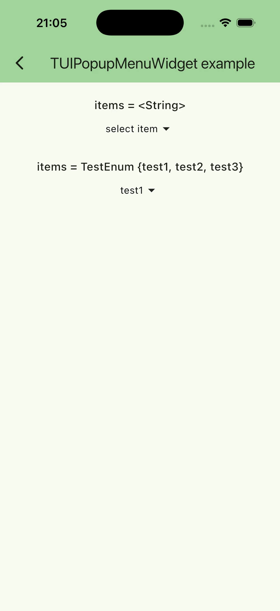

# TUIPopupMenuWidget<T>

Russian version: [popup_menu_widget_doc_ru.md](popup_menu_widget_doc_ru.md)

A highly customizable popup menu widget for selecting an item.



## Quick start

```dart
final items = <String>[
  'item 1',
  'item 2',
  'item 3',
  'item 4',
  'item 5',
  'item 6',
  'item 7',
  'item 8',
];

String? _selectedItem;

void _onSelected(String item) => setState(() => _selectedItem = item);

TUIPopupMenuWidget<String>(
  items: items,
  selectedItem: _selectedItem ?? 'select item',
  onSelected: _onSelected,
);
```

## Example

[example/lib/usage_examples/tui_popup_menu_widget.dart](https://github.com/JohnSmithKarter/tunable_ui_kit/blob/main/example/lib/usage_examples/tui_popup_menu_widget.dart)

### Parameters

#### items

Items list.

#### selectedItem

Selected item.

#### initialValue

Initial value.

#### onSelected

Selection callback.

#### itemToString

Function to format an item to text.

If not provided, the default `toString()` is used for `T`.

#### enabled

Whether the widget is enabled.

#### popupDecoration

Popup widget style (`TUIPopupDecoration`).

#### popupMenuDecoration

Popup menu style (`TUIPopupMenuDecoration`).

#### popupElementDecoration

Popup menu item style (`TUIPopupElementDecoration`).
