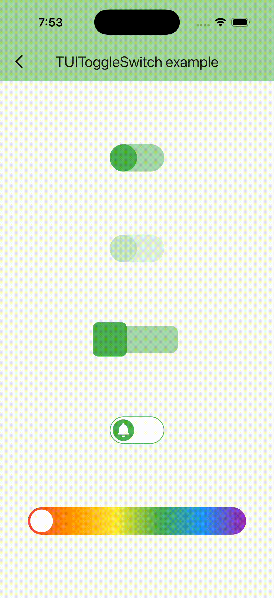

# TUIToggleSwitch

English version: [tui_toggle_switch_screen_doc.md](tui_toggle_switch_screen_doc.md)

Тонко кастомизируемый переключатель для выбора логического состояния.



## Быстрый старт

```dart
bool _isEnabled = false;

void _onChanged(bool value) => setState(() => _isEnabled = value);

TUIToggleSwitch(
  size: 40,
  aspectRatio: 2,
  initialValue: _isEnabled,
  onChanged: _onChanged,
);
```

## Пример

[example/lib/usage_examples/tui_toggle_switch_screen.dart](https://github.com/JohnSmithKarter/tunable_ui_kit/blob/main/example/lib/usage_examples/tui_toggle_switch_screen.dart)

### Параметры

#### size

Размер (высота) переключателя.

**Тип:** `double` (обязательный)

#### aspectRatio

Соотношение сторон переключателя (ширина / высота).

**Тип:** `double?`

**По умолчанию:** `1.5`

#### duration

Длительность анимации переключения.

**Тип:** `Duration`

**По умолчанию:** `300ms`

#### curve

Кривая анимации переключения.

**Тип:** `Curve`

**По умолчанию:** `Curves.easeInOut`

#### initialValue

Начальное состояние переключателя.

**Тип:** `bool`

**По умолчанию:** `false`

#### enabled

Включен ли переключатель.

**Тип:** `bool`

**По умолчанию:** `true`

#### margin

Отступ вокруг переключателя.

**Тип:** `EdgeInsetsGeometry?`

**По умолчанию:** `null`

#### onChanged

Callback при изменении значения переключателя.

**Тип:** `ValueChanged<bool>?`

**По умолчанию:** `null`

#### onBeforeToggle

Callback перед изменением значения переключателя. Вернуть `false` для отмены переключения.

**Тип:** `Future<bool> Function(bool newValue)?`

**По умолчанию:** `null`

#### settings

Настройки стиля переключателя (`TUIToggleSwitchSettings`).

**Тип:** `TUIToggleSwitchSettings?`

**По умолчанию:** `null`

#### thumbSettings

Настройки стиля ползунка (`TUIToggleThumbSettings`).

**Тип:** `TUIToggleThumbSettings?`

**По умолчанию:** `null`

## TUIToggleSwitchSettings

Конфигурация стиля переключателя.

### Параметры

#### color

Цвет переключателя в неактивном состоянии.

**Тип:** `Color?`

**По умолчанию:** `Colors.green[200]`

#### activeColor

Цвет переключателя в активном состоянии.

**Тип:** `Color?`

**По умолчанию:** `Colors.green[200]`

#### borderRadius

Скругление углов переключателя.

**Тип:** `double?`

**По умолчанию:** `size / 2` (круглый)

#### border

Граница переключателя.

**Тип:** `BoxBorder?`

**По умолчанию:** `null`

#### boxShadow

Тень переключателя.

**Тип:** `List<BoxShadow>?`

**По умолчанию:** `null`

#### gradient

Градиент переключателя.

**Тип:** `Gradient?`

**По умолчанию:** `null`

#### image

Фоновое изображение переключателя.

**Тип:** `DecorationImage?`

**По умолчанию:** `null`

#### opacity

Прозрачность переключателя.

**Тип:** `double?`

**По умолчанию:** `1.0` (включен) или `0.5` (отключен)

## TUIToggleThumbSettings

Конфигурация стиля ползунка переключателя.

### Параметры

#### size

Размер ползунка.

**Тип:** `double?`

**По умолчанию:** `size` (равен высоте переключателя)

#### color

Цвет ползунка.

**Тип:** `Color?`

**По умолчанию:** `Colors.green`

#### borderRadius

Скругление углов ползунка.

**Тип:** `double?`

**По умолчанию:** `size / 2` (круглый)

#### gradient

Градиент ползунка.

**Тип:** `Gradient?`

**По умолчанию:** `null`

#### boxShadow

Тень ползунка.

**Тип:** `List<BoxShadow>?`

**По умолчанию:** `null`

#### image

Фоновое изображение ползунка.

**Тип:** `DecorationImage?`

**По умолчанию:** `null`

#### border

Граница ползунка.

**Тип:** `BoxBorder?`

**По умолчанию:** `null`

#### shape

Форма ползунка.

**Тип:** `BoxShape`

**По умолчанию:** `BoxShape.rectangle`

#### customThumb

Кастомный виджет для использования вместо стандартного ползунка.

**Тип:** `Widget?`

**По умолчанию:** `null`

## Примеры

### Базовый переключатель

```dart
TUIToggleSwitch(
  size: 40,
  aspectRatio: 2,
  onChanged: (value) => print('Переключено: $value'),
);
```

### Переключатель с кастомными цветами

```dart
TUIToggleSwitch(
  size: 40,
  aspectRatio: 2,
  settings: TUIToggleSwitchSettings(
    color: Colors.grey[300],
    activeColor: Colors.blue,
  ),
  thumbSettings: TUIToggleThumbSettings(
    color: Colors.white,
  ),
);
```

### Переключатель с кастомным размером ползунка

```dart
TUIToggleSwitch(
  size: 40,
  aspectRatio: 2,
  thumbSettings: TUIToggleThumbSettings(
    size: 35,
  ),
);
```

### Переключатель с кастомным виджетом ползунка

```dart
TUIToggleSwitch(
  size: 40,
  aspectRatio: 2,
  thumbSettings: TUIToggleThumbSettings(
    customThumb: Icon(
      Icons.circle_notifications,
      size: 38,
      color: Colors.blue,
    ),
  ),
);
```

### Переключатель с градиентом

```dart
TUIToggleSwitch(
  size: 40,
  aspectRatio: 2,
  settings: TUIToggleSwitchSettings(
    gradient: LinearGradient(
      colors: [Colors.red, Colors.blue],
    ),
  ),
);
```

### Отключённый переключатель

```dart
TUIToggleSwitch(
  size: 40,
  aspectRatio: 2,
  enabled: false,
  settings: TUIToggleSwitchSettings(
    opacity: 0.3,
  ),
);
```

### Переключатель с валидацией

```dart
TUIToggleSwitch(
  size: 40,
  aspectRatio: 2,
  onBeforeToggle: (newValue) async {
    // Выполнить валидацию
    final isValid = await validateToggle(newValue);
    return isValid;
  },
  onChanged: (value) => print('Переключение подтверждено: $value'),
);
```
